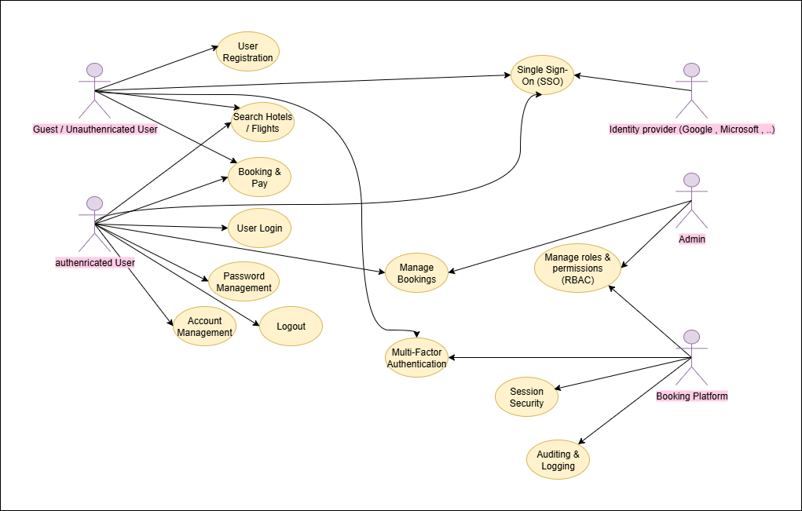

# 🔐 Authentication & Authorization System Design  
### Booking Platform (Hotels / Flights)

---

## 📌 Content List
1. [Vision](#vision)
2. [Goals](#goals)
3. [Requirements](#requirements)  
   3.1. [Functional Requirements](#functional-requirements)  
   3.2. [Non-Functional Requirements](#non-functional-requirements)  
   3.3. [Security Requirements](#security-requirements)  
4. [Use Case Model](#use-case-model)  
   4.1. [Actors](#actors)  
   4.2. [Use Cases](#use-cases)  
   4.3. [Use Case Diagram](#use-case-diagram)  
5. [Security Architecture](#security-architecture)  
   5.1. [Architecture Overview](#architecture-overview)  
   5.2. [Authentication Flows](#authentication-flows)  
   5.3. [Authorization Model](#authorization-model)  
6. [Database Design](#database-design)  
   6.1. [Data Model](#data-model)  
   6.2. [ERD Diagram](#erd-diagram)  
   6.3. [SQL Scripts (PostgreSQL)](#sql-scripts)  
7. [API Design](#api-design)  
   7.1. [Authentication APIs](#authentication-apis)  
   7.2. [Authorization APIs](#authorization-apis)  
   7.3. [Error Handling](#error-handling)

---

## 1. Vision
Provide a secure, scalable, and user-friendly **Authentication (AuthN)** and **Authorization (AuthZ)** system for a **Booking Platform** that handles hotel and flight reservations.  
The system must support **multiple authentication methods**, enforce **role-based access control (RBAC)**, and ensure **data security and privacy**.

---

## 2. Goals
- Support **secure login** via Email/Password, OTP (email verification), and Social Login (OAuth2).  
- Implement **RBAC** for different user roles (Guest, Customer, Host, Admin).  
- Protect sensitive data (bookings, payments, user profiles).  
- Ensure **scalability** with token-based authentication and Redis caching.  
- Maintain **compliance** with GDPR/CCPA (user privacy, data retention).  

---

## 3. Requirements

### 3.1 Functional Requirements
- User Registration & Login (Email/Password, OTP, OAuth2).
- Password reset and account recovery.
- Role-based access control (Guest, Customer, Host, Admin).
- Multi-Factor Authentication (MFA) (optional).
- Guest Checkout (booking without account).
- Audit logging for login, logout, password resets, and role changes.

### 3.2 Non-Functional Requirements
- **Security:** bcrypt/argon2 password hashing, HTTPS, CSRF protection.  
- **Performance:** Token validation via Redis for low latency.  
- **Usability:** Intuitive signup/login flows with clear error messages.  
- **Reliability:** High availability with horizontal scaling.  
- **Privacy:** Compliance with GDPR/CCPA.  

### 3.3 Security Requirements
- All tokens must be **signed & encrypted**.  
- Sessions auto-expire (idle + absolute timeout).  
- Brute-force prevention: rate limiting + account lockout.  
- MFA support for critical operations.  

---

## 4. Use Case Model

### 4.1 Actors
- **Guest (Unauthenticated User)**  
- **Customer (Registered User)**
- **Admin (Platform Administrator)**
- **Identity Provider (Google/Facebook)**

### 4.2 Use Cases
- Register / Login (Email/Password, OTP, OAuth2)  
- Reset password  
- Manage roles & permissions  

### 4.3 Use Case Diagram



---

## 5. Security Architecture

### 5.1 Architecture Overview

* **Backend:** Node.js (Express/Nest js) + PostgreSQL + TypeORM
* **Caching & Token Store:** Redis (ioredis)
* **Token Strategy:** JWT (Access + Refresh)
* **MFA & Emails:** External provider (SendGrid)

### 5.2 Authentication Flows

* Email + Password (Admin Login)
* Email + Verification Code (OTP)
* Social Login (OAuth2)
* Password Reset Flow

👉 Detailed **Flow Steps & sequence diagrams** are included in [`./authentication-flows.md`](./authentication-flows.md).

### 5.3 Authorization Model

* **RBAC (Role-Based Access Control)** with roles: Guest, Customer, Admin.

| Role     | Capabilities                   |
| -------- | ------------------------------ |
| Guest    | Browse, Guest Checkout         |
| Customer | Manage own bookings, profile , review   |
| Admin    | Full access                    |

---

## 6. Database Design

### 6.1 Data Model

Here’s your **updated 6.1 Data Model section**, fully integrated with the detailed attributes, relationships, and purposes you provided:

---

### 6.1 Data Model

### **User**

* **Attributes:**
  `user_id` (PK)
  `email` (unique)
  `password_hash`
  `name`
  `gender`
  `phone`
  `birth_date`
  `is_active` (boolean)
  `is_locked` (boolean)
  `mfa_enabled` (boolean)
  `created_at`, `updated_at`

* **Relationships:**

  * One-to-many with **Session**, **RefreshToken**, **AuditLog**, **MFA**
  * Many-to-many with **Role** via **UserRole**

### **Role**

* **Attributes:**
  `role_id` (PK)
  `name` (unique)
  `description`
  `created_at`, `updated_at`

* **Relationships:**

  * Many-to-many with **User** via **UserRole**
  * Many-to-many with **Permission** via **RolePermission**

### **Permission**

* **Attributes:**
  `permission_id` (PK)
  `name` (unique)
  `description`
  `created_at`, `updated_at`

* **Relationships:**

  * Many-to-many with **Role** via **RolePermission**

### **UserRole**

* **Attributes:**
  `user_id` (FK → User.user_id)
  `role_id` (FK → Role.role_id)

* **Notes:**

  * Composite PK: `(user_id, role_id)`
  * Represents many-to-many relationship between **User** and **Role**

### **RolePermissions**

* **Attributes:**
  `role_id` (FK → Roles.role_id)
  `permission_id` (FK → Permission.permission_id)

* **Notes:**

  * Composite PK: `(role_id, permission_id)`
  * Represents many-to-many relationship between **Role** and **Permission**


### **Auditing**

* **Attributes:**
  `audit_id` (PK)
  `user_id` (FK → User.user_id)
  `audit_event`
  `audit_data`
  `audit_date`
  `status`
  `created_at`

* **Purpose:**

  * Track critical security events: logins, password resets, role changes

### 6.2 ERD Diagram

```mermaid
erDiagramerDiagram
    USER {
        int user_id PK
        string email "unique"
        string password_hash
        string name
        string gender
        string phone
        date birth_date
        boolean is_active
        boolean is_locked
        boolean mfa_enabled
        datetime created_at
        datetime updated_at
    }

    ROLE {
        int role_id PK
        string name "unique"
        text description
        datetime created_at
        datetime updated_at
    }

    PERMISSION {
        int permission_id PK
        string name "unique"
        text description
        datetime created_at
        datetime updated_at
    }

    USERROLE {
        int user_id FK
        int role_id FK
    }

    ROLEPERMISSION {
        int role_id FK
        int permission_id FK
    }

    AUDITING {
        int audit_id PK
        int user_id FK
        json audit_event
        json audit_data
        datetime audit_date
        string status
        datetime created_at
    }

    %% Relationships
    USER ||--o{ USERROLE : has
    ROLE ||--o{ USERROLE : assigned_to
    ROLE ||--o{ ROLEPERMISSION : grants
    PERMISSION ||--o{ ROLEPERMISSION : includes
    USER ||--o{ AUDITING : triggers
```

### 6.3 SQL Scripts

-- ==========================================
-- Table: USER
-- ==========================================
CREATE TABLE "User" (
    user_id SERIAL PRIMARY KEY,
    name VARCHAR(255) NOT NULL,
    email VARCHAR(255) UNIQUE NOT NULL,
    password_hash VARCHAR(255) NOT NULL,
    birth_date DATE NULL,
    gender VARCHAR(6) CHECK (gender IN ('male', 'female'))
    phone VARCHAR(20),
    is_active BOOLEAN DEFAULT TRUE,
    is_locked BOOLEAN DEFAULT FALSE,
    mfa_enabled BOOLEAN DEFAULT FALSE,
    created_at TIMESTAMP DEFAULT NOW(),
    updated_at TIMESTAMP DEFAULT NOW()
);

-- ==========================================
-- Table: ROLE
-- ==========================================
CREATE TABLE "Role" (
    role_id SERIAL PRIMARY KEY,
    name VARCHAR(100) UNIQUE NOT NULL,
    description TEXT,
    created_at TIMESTAMP DEFAULT NOW(),
    updated_at TIMESTAMP DEFAULT NOW()
);

-- ==========================================
-- Table: PERMISSION
-- ==========================================
CREATE TABLE "Permission" (
    permission_id SERIAL PRIMARY KEY,
    name VARCHAR(100) UNIQUE NOT NULL,
    description TEXT,
    created_at TIMESTAMP DEFAULT NOW(),
    updated_at TIMESTAMP DEFAULT NOW()
);

-- ==========================================
-- Table: USERROLE (junction table)
-- ==========================================
CREATE TABLE "UserRole" (
    user_id INT NOT NULL,
    role_id INT NOT NULL,
    PRIMARY KEY (user_id, role_id),
    FOREIGN KEY (user_id) REFERENCES "User"(user_id) ON DELETE CASCADE,
    FOREIGN KEY (role_id) REFERENCES "Role"(role_id) ON DELETE CASCADE
);

-- ==========================================
-- Table: ROLEPERMISSION (junction table)
-- ==========================================
CREATE TABLE "RolePermission" (
    role_id INT NOT NULL,
    permission_id INT NOT NULL,
    PRIMARY KEY (role_id, permission_id),
    FOREIGN KEY (role_id) REFERENCES "Role"(role_id) ON DELETE CASCADE,
    FOREIGN KEY (permission_id) REFERENCES "Permission"(permission_id) ON DELETE CASCADE
);

-- ==========================================
-- Table: AUDITING
-- ==========================================
CREATE TABLE "Auditing" (
    audit_id SERIAL PRIMARY KEY,
    user_id INT REFERENCES "User"(user_id) ON DELETE SET NULL,
    audit_event JSON,
    audit_data JSON,
    audit_date TIMESTAMP NOT NULL DEFAULT NOW(),
    status VARCHAR(50),
    created_at TIMESTAMP DEFAULT NOW()
);

---

## 7. API Design

### 7.1 Authentication APIs

```http
POST /auth/signup          { email, password }
POST /auth/login           { email, password }
POST /auth/login/otp       { email, code }
GET  /auth/oauth/google    → Redirect to Google
POST /auth/refresh         { refreshToken }
POST /auth/logout
POST /auth/password-reset/request { email }
POST /auth/password-reset/confirm { email, token, newPassword }
```

### 7.2 Authorization APIs

```http
POST /auth/roles/assign    { userId, roleId }
POST /auth/roles/remove    { userId, roleId }
GET  /auth/check-access?permission=booking:cancel
```

### 7.3 Error Handling
* `400 Bad Request` – Malformed request or invalid input parameters.
* `401 Unauthorized` – Invalid credentials/token.
* `403 Forbidden` – Insufficient permissions.
* `423 Locked` – Account is locked due to too many failed login attempts.
* `429 Too Many Requests` – Rate limit exceeded.
* `500 Internal Server Error` - Unexpected server error.
---

