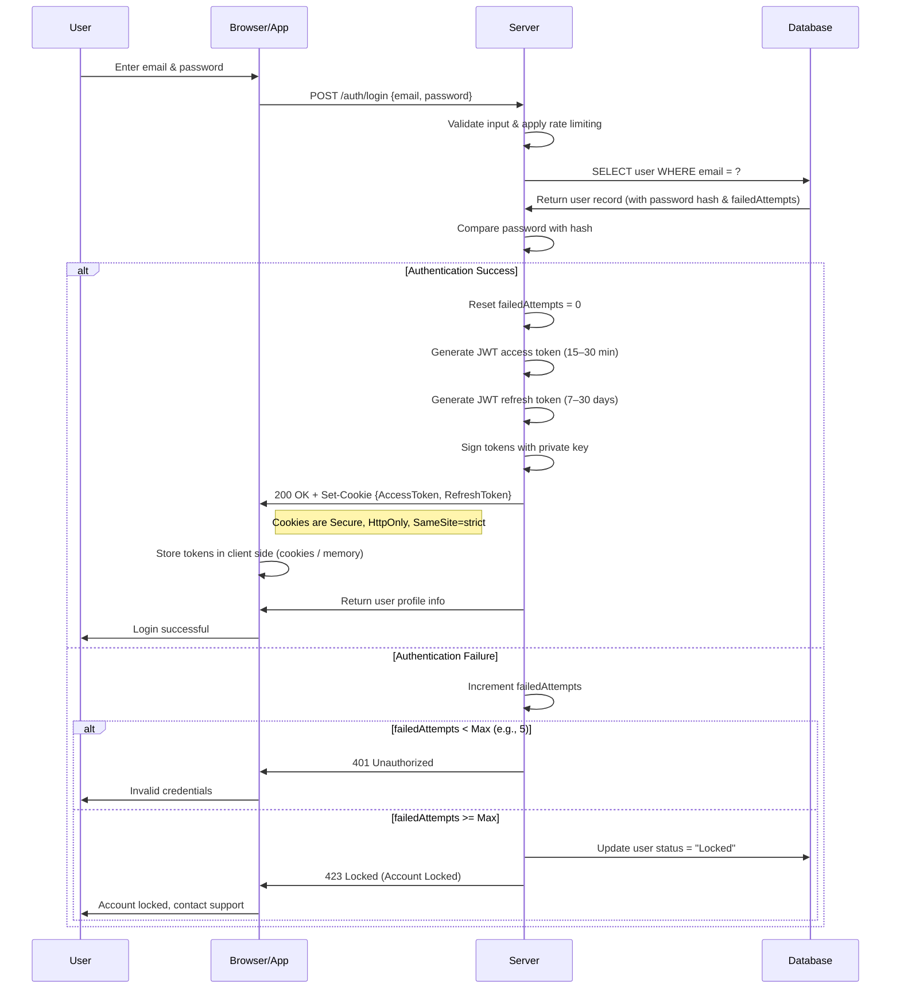
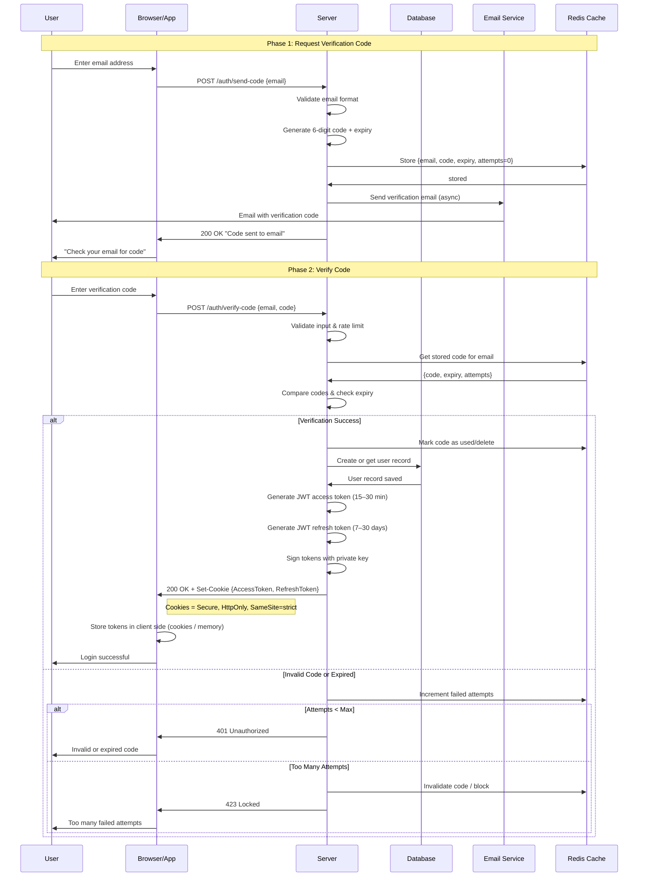
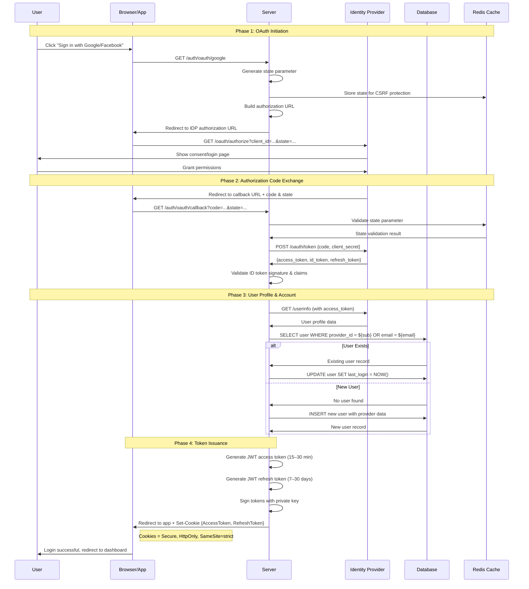
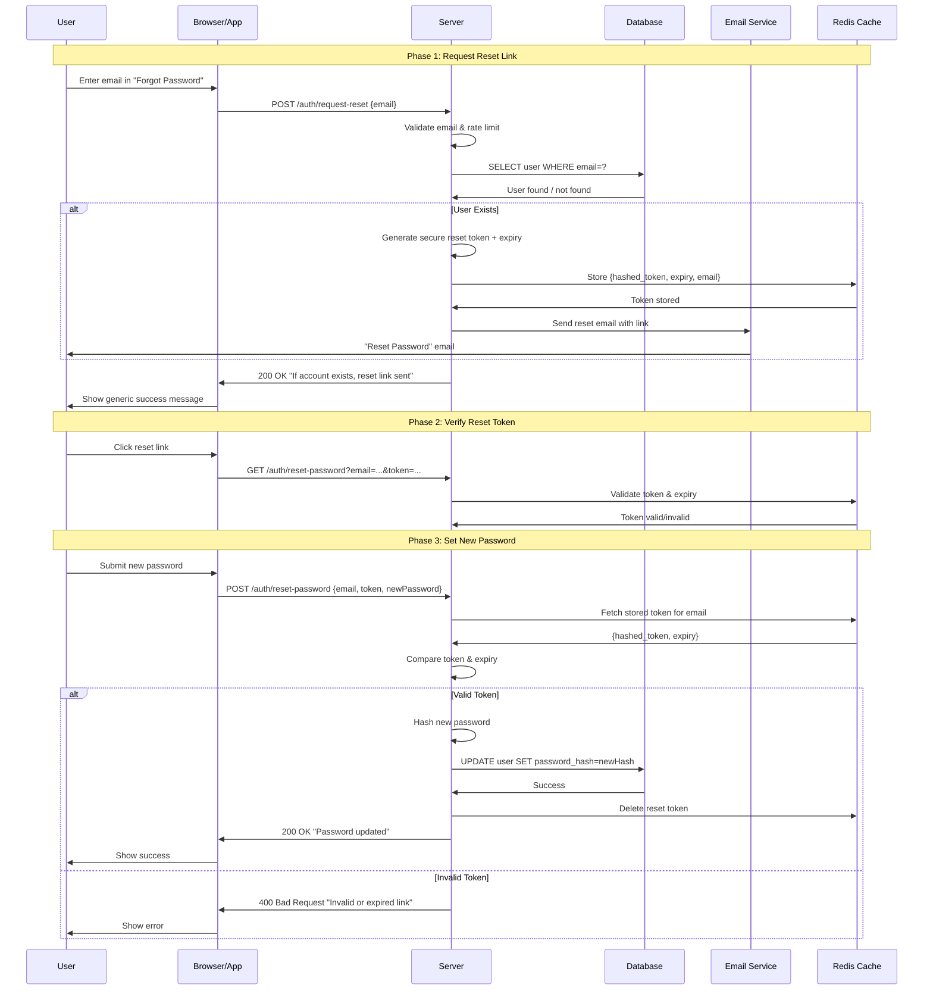

# **5. Authentication & Password Reset Flows**

The platform supports multiple authentication methods and password management.
Below are the detailed **server-side flow steps** and **sequence diagrams** for each flow.

---

## **5.1 Email + Password Authentication (Admin Login)**

### **Flow Steps**

#### 🔹 Request Validation

* Validate email format and enforce password policy (min length, complexity).
* Sanitize input to prevent SQL injection or XSS.
* Apply rate limiting per IP and per email.

#### 🔹 Credential Verification

* Query database for admin by email.
* Compare provided password with stored hash (bcrypt/argon2).
* Check if account is active and not locked.
* If login fails → increment `failedAttempts`.
* Lock account if attempts exceed maximum threshold.

#### 🔹 Token Generation

* On success → reset `failedAttempts`.
* Generate **JWT access token** (short-lived: 15–30 min).
* Generate **JWT refresh token** (long-lived: 7–30 days).
* Sign tokens with server’s **private key**.
* Set tokens as **Secure, HttpOnly, SameSite=strict cookies**.

#### 🔹 Response Handling

* **Success** → return user profile + set cookies.
* **Failure** → log failed attempt, return generic error (`401 Unauthorized` or `423 Locked` if account locked).

### **Sequence Diagram**



---

## **5.2 Email + Verification Code Authentication**

### **Flow Steps**

#### 🔹 Email Request Phase

* Validate email format.
* Check if email exists in the system; if not, create a temporary/pending user record.
* Generate a **6-digit one-time code** with short expiry (5–10 minutes).
* Store code in **cache/database** with: `{email, code, expiry, attempts=0}`.
* Send code via email service (asynchronous, non-blocking).
* Return success response: *“Code sent to email”*.

#### 🔹 Code Verification Phase

* Validate code format and apply rate limiting (per IP/email).
* Retrieve stored code from cache/database.
* Check if code exists, is not expired, and attempts < max (e.g., 5).
* Compare provided code with stored code.
* If match → mark code as used (delete/expire).
* If mismatch or expired → increment attempts, block after max failures.

#### 🔹 Authentication Success

* Create or get user record in the database.
* Generate **JWT access token** (15–30 minutes).
* Generate **JWT refresh token** (7–30 days).
* Sign tokens with the server’s **private key**.
* Set tokens as **Secure, HttpOnly, SameSite=strict cookies**.
* Clean up verification code (remove from cache/DB).
* Return user profile + authentication tokens.

### **Sequence Diagram**



---

## **5.3 Social Login (OAuth 2.0) Authentication**

*(Google / Facebook, OpenID Connect compatible)*

### **Flow Steps**

1. **Client Side – Start OAuth**

   * User clicks **“Login with Google”**.
   * Frontend calls **GET /auth/oauth/google**.
   * Backend generates authorization URL & redirects browser.

2. **User → Identity Provider → Back to Server**

   * User logs in & approves consent.
   * Provider redirects browser to backend callback URL with `code` & `state`.

3. **Server Side – Exchange Code for Tokens**

   * Validate `state`.
   * POST to provider token endpoint with code & client credentials.
   * Receive `access_token`, `refresh_token`, `id_token`.

4. **Server Side – Get User Profile**

   * Use `access_token` to fetch user info.

5. **Server Side – Create/Find User**

   * Check DB for existing user by `sub` or `email`.
   * Create new user if not exists.

6. **Server Side – Generate Internal Tokens**

   * Generate JWT access + refresh tokens.
   * Set as **Secure, HttpOnly cookies**.
   * Redirect user to frontend.

### **Sequence Diagram**



---

## **5.4 Password Reset Flow (with Email Verification)**

### **Flow Steps**

#### 🔹 Request Reset Link

1. Validate submitted email.
2. Query DB; if no user exists → return generic success.
3. If exists → generate secure random reset token + expiry.
4. Store hashed token + expiry in DB/cache.
5. Send reset link to user:

```
https://my-app.com/reset-password?token=<raw_token>&email=<email>
```

#### 🔹 Verify Reset Token

1. User clicks link → frontend shows reset form.
2. Backend receives `{email, token}`.
3. Validate token format & lookup stored token.
4. Check expiry & one-time-use flag.

#### 🔹 Set New Password

1. User submits new password (validate strength).
2. Compare token (hash match).
3. If valid → hash new password, update DB, invalidate token, invalidate old sessions.
4. Response: success → `"Password updated successfully"`, failure → `"Invalid or expired reset link"`.

### **Sequence Diagram**



